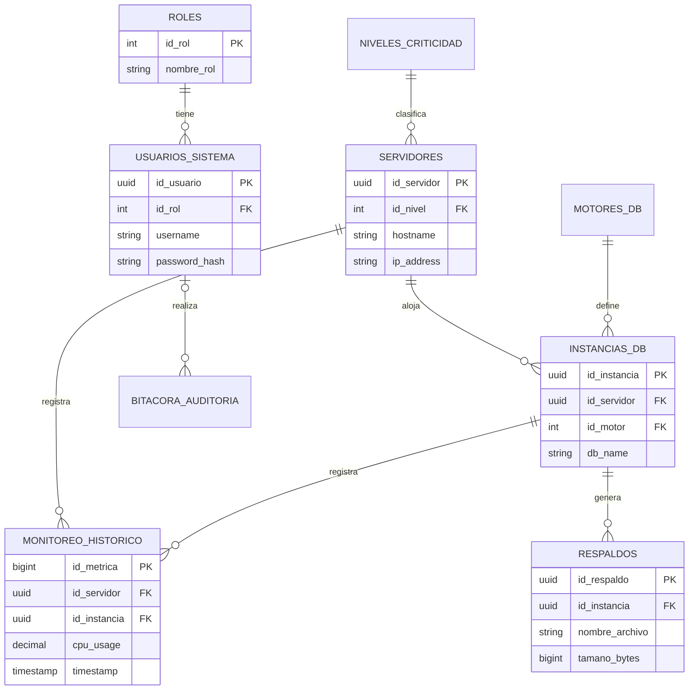

# Modelo Lógico de Base de Datos - SGIR

Este documento define los atributos, tipos de datos y relaciones del esquema de PostgreSQL.

## 1. Tablas y Atributos

### Roles y Usuarios (Acceso al Sistema)
*   **`roles`**
    *   `id_rol` (PK, Serial): Identificador único.
    *   `nombre_rol` (Varchar, 50, Unique): Administrador, Operador, Auditor.
    *   `descripcion` (Text): Descripción de permisos.

*   **`usuarios_sistema`**
    *   `id_usuario` (PK, UUID): Identificador único del usuario.
    *   `id_rol` (FK -> roles): Relación con tabla de roles.
    *   `username` (Varchar, 50, Unique): Nombre de usuario.
    *   `email` (Varchar, 100, Unique): Correo electrónico.
    *   `password_hash` (Varchar): Contraseña cifrada.
    *   `esta_activo` (Boolean): Estado del usuario.
    *   `creado_en` (Timestamp): Fecha de registro.

### Infraestructura (Assets)
*   **`niveles_criticidad`**
    *   `id_nivel` (PK, Serial): 1, 2, 3.
    *   `nombre_nivel` (Varchar, 50): Estándar, Productivo, Misión Crítica.
    *   `politica_retencion_dias` (Integer): Días para conservar backups según nivel.

*   **`motores_db`**
    *   `id_motor` (PK, Serial): ID del motor.
    *   `nombre_motor` (Varchar, 50): MySQL, Oracle, MongoDB.
    *   `version` (Varchar, 20): Versión específica (ej: 19c).
    *   `es_legacy` (Boolean): Flag para activar drivers antiguos.

*   **`servidores`**
    *   `id_servidor` (PK, UUID): ID único del nodo.
    *   `id_nivel` (FK -> niveles_criticidad): Relación con criticidad.
    *   `hostname` (Varchar, 100): Nombre de red.
    *   `ip_address` (Varchar/Inet): Dirección IP.
    *   `os_type` (Varchar, 50): Linux, Solaris, Windows.
    *   `ssh_user` (Varchar, 50): Usuario para conexión remota.
    *   `ssh_port` (Integer): Puerto (Default 22).
    *   `ssh_key_path` (Varchar): Ruta a la llave privada SSH.

*   **`instancias_db`**
    *   `id_instancia` (PK, UUID): ID único de la base de datos.
    *   `id_servidor` (FK -> servidores): Servidor donde reside.
    *   `id_motor` (FK -> motores_db): Tipo de motor y versión.
    *   `db_name` (Varchar, 100): Nombre de la base de datos.
    *   `db_user` (Varchar, 50): Usuario de monitoreo en la RDBMS.
    *   `db_password` (Varchar): Contraseña de monitoreo (Cifrada).
    *   `puerto_db` (Integer): Puerto de escucha de la RDBMS.

### Operaciones (Métricas y Logs)
*   **`monitoreo_historico`**
    *   `id_metrica` (PK, BigSerial): ID incremental.
    *   `id_servidor` (FK -> servidores): Nodo monitoreado.
    *   `id_instancia` (FK -> instancias_db): DB monitoreada.
    *   `cpu_usage` (Decimal): % de CPU.
    *   `ram_usage` (Decimal): % de RAM.
    *   `disco_usage` (Decimal): % de Disco.
    *   `conexiones_activas` (Integer): Sesiones actuales.
    *   `peso_total_gb` (Decimal): Tamaño de la DB.
    *   `timestamp` (Timestamp): Fecha y hora de la métrica.

*   **`respaldos`**
    *   `id_respaldo` (PK, UUID): ID del backup.
    *   `id_instancia` (FK -> instancias_db): DB respaldada.
    *   `nombre_archivo` (Varchar): BK_{db_name}_{fecha}.sql.gz.
    *   `ruta_local` (Varchar): Ruta en el servidor SGIR.
    *   `ruta_nube` (Varchar, Null): Ruta en S3/Azure.
    *   `tamano_bytes` (BigInt): Tamaño físico.
    *   `sha256_hash` (Varchar): Hash de integridad.
    *   `estado` (Varchar, 20): Exitoso, Fallido, Proceso.
    *   `fecha_ejecucion` (Timestamp).

*   **`bitacora_auditoria`**
    *   `id_log` (PK, BigSerial): ID único.
    *   `id_usuario` (FK -> usuarios_sistema, Null): Actor de la acción.
    *   `accion` (Varchar, 200): Descripción (ej: "Inicio de Backup").
    *   `metadata` (JSONB): Detalles adicionales de la operación.
    *   `timestamp` (Timestamp).

## 2. Relaciones (Cardinalidad)
1.  **Roles (1) --- (N) Usuarios**: Un rol puede tener muchos usuarios.
2.  **Criticidad (1) --- (N) Servidores**: Un nivel agrupa muchos servidores.
3.  **Servidor (1) --- (N) Instancias DB**: Un servidor puede tener varias bases de datos.
4.  **Motor (1) --- (N) Instancias DB**: Un motor (ej: Oracle 19c) puede estar en muchas instancias.
5.  **Instancia (1) --- (N) Respaldos**: Una base de datos genera múltiples backups en el tiempo.
6.  **Servidor/Instancia (1) --- (N) Monitoreo**: Múltiples registros históricos de métricas.

## 3. Diagrama Entidad-Relación (Mermaid)

