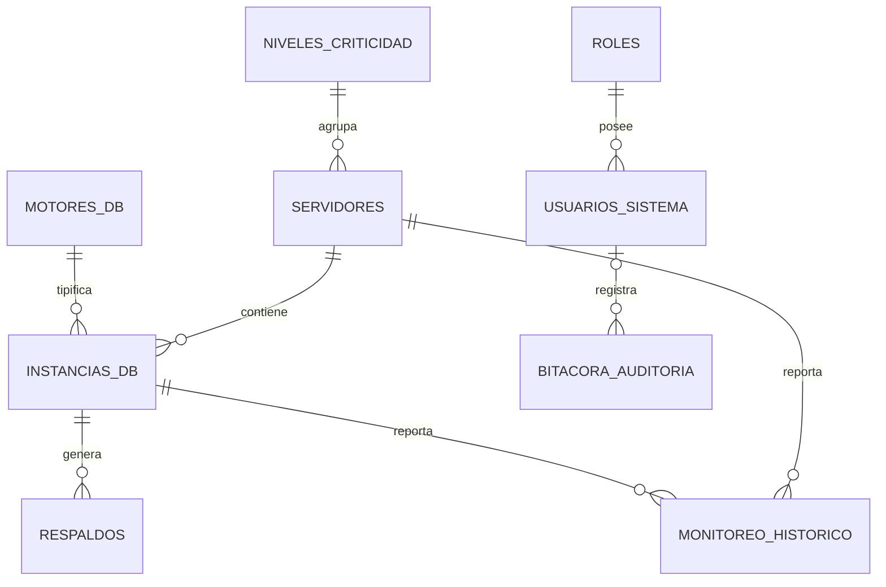

# Relaciones de Base de Datos - SGIR

Este documento describe cómo interactúan las tablas del sistema SGIR y las reglas de integridad referencial aplicadas.

## 1. Mapa de Relaciones

### Acceso y Seguridad
*   **`roles` 1 : N `usuarios_sistema`**
    *   **FK**: `usuarios_sistema.id_rol` -> `roles.id_rol`
    *   **Propósito**: Define los permisos de cada usuario dentro de la plataforma.

### Inventario de Activos (Infraestructura)
*   **`niveles_criticidad` 1 : N `servidores`**
    *   **FK**: `servidores.id_nivel` -> `niveles_criticidad.id_nivel`
    *   **Propósito**: Clasifica los servidores para aplicar políticas de retención y priorización.
*   **`servidores` 1 : N `instancias_db`**
    *   **FK**: `instancias_db.id_servidor` -> `servidores.id_servidor`
    *   **Integridad**: `ON DELETE CASCADE`. Si se elimina un servidor del inventario, se eliminan lógicamente sus instancias asociadas.
*   **`motores_db` 1 : N `instancias_db`**
    *   **FK**: `instancias_db.id_motor` -> `motores_db.id_motor`
    *   **Propósito**: Identifica el driver y la versión de RDBMS que el backend debe usar.

### Operaciones y Métricas
*   **`instancias_db` 1 : N `respaldos`**
    *   **FK**: `respaldos.id_instancia` -> `instancias_db.id_instancia`
    *   **Integridad**: `ON DELETE CASCADE`. Los registros de respaldos dependen de la existencia de la instancia.
*   **`servidores` 1 : N `monitoreo_historico`**
    *   **FK**: `monitoreo_historico.id_servidor` -> `servidores.id_servidor`
    *   **Integridad**: `ON DELETE SET NULL`. Si un servidor se borra, mantenemos las métricas históricas para fines estadísticos, pero desvinculadas.
*   **`instancias_db` 1 : N `monitoreo_historico`**
    *   **FK**: `monitoreo_historico.id_instancia` -> `instancias_db.id_instancia`
    *   **Integridad**: `ON DELETE SET NULL`.

### Auditoría
*   **`usuarios_sistema` 1 : N `bitacora_auditoria`**
    *   **FK**: `bitacora_auditoria.id_usuario` -> `usuarios_sistema.id_usuario`
    *   **Integridad**: `ON DELETE SET NULL`. Si un usuario es eliminado, la bitácora persiste para trazabilidad histórica.

## 2. Resumen de Integridad Referencial

| Tabla Origen | Tabla Destino | Llave Foránea | Acción al Eliminar |
| :--- | :--- | :--- | :--- |
| `roles` | `usuarios_sistema` | `id_rol` | RESTRICT |
| `niveles_criticidad` | `servidores` | `id_nivel` | RESTRICT |
| `servidores` | `instancias_db` | `id_servidor` | CASCADE |
| `motores_db` | `instancias_db` | `id_motor` | RESTRICT |
| `instancias_db` | `respaldos` | `id_instancia` | CASCADE |
| `servidores` | `monitoreo_historico` | `id_servidor` | SET NULL |
| `usuarios_sistema` | `bitacora_auditoria` | `id_usuario` | SET NULL |

## 3. Diagrama Visual (Mermaid)

